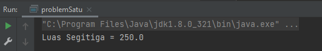
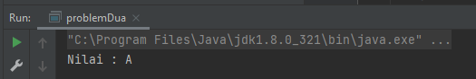
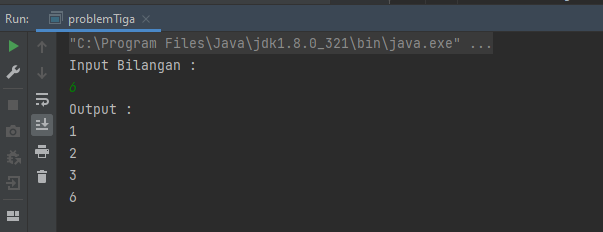
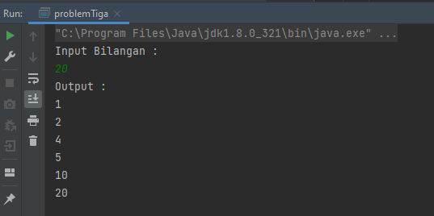
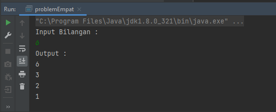
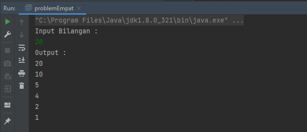
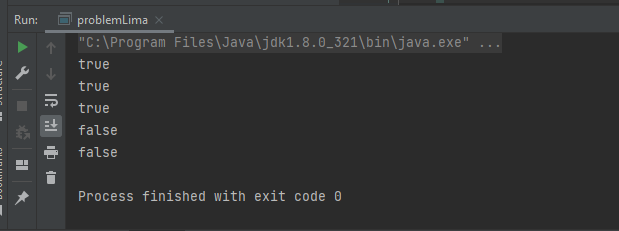

# 10 Introduction Basic Programing

## Java

keuntungan dari java :

     1.bahasa pemograman lebih sederhana
     2.hanya fokus pada objek
     3.pengamanan yang cukup ketat
     4.dapat dipakai pada sistem operasi manapun
     5.gunakan sistem extensions handling 
     6.mendukung native method
     7.terdapat gerbage collector (mengumpulkan sampah secara otomatis)
     8.daftar pustaka lengkap
     9.adanya fitur GUI
     10.penyempurnaan c++
     11.dapat digunakan diberbagai platform

 tool : 

 -JDK (java Development kit)
 debugging,monitoring,debelopping

 -IDE (Integrated Development Environtment)
 contoh intelih IDEA,esclipse,bluej,netbeans

## Basic Programing

### a)tipe data

      1) integer : Untuk bilangan bulat
      2) Float : Berlaku untuk bilangan yang lebih kompleks misalnya seperti angka 
                 yang berkoma
      3) Double : lebih kompleks lagi dari float
      4) Bolean : untuk kondisi false dan true
      5) Char : untuk menginputkan satu karakter seperti "A","z"
      6) String : untuk menginputkan kata seperti "mobil"

### b)Operator
    
     1) Assigment 
     2) Arithmetic : untuk melakukan operasi seperti penjumlahan,pengurangan dll
     3) Unary 
     4) Equality dan relational : Untuk menyatakan besar sama,kecil sama,besar dari
                                  kecil dari,tidak sama dan sebagainya
     5) Conditional : ada dua yaitu "AND(&&)" dan "OR(||)"

### c)Input Output

      pada input output ini membantu kita ketika merangkai kode,nantinya dengan 
      menggunakan input output ini kita dapat menginputkan sesuatu pada saat running
      kemudian hasil dari input tadi akan muncul juga pada hasil running.jadi kita
      menginputkannya pada saat program dirunning bukan di program kita input datanya.

### d)Looping

      looping atau pengulangan ini akan membantu kita dalam membuat program yang membutuhkan
      pengulangan pada outputnya,contohnya kita akan mengeluarkan output "selamat datang" 
      sebanyak 20,maka dengan looping ini kita tidak perlu membuat program untuk outputnya
      sebanyak 20 namun cukup dengan perintah looping saja.
      looping ada 3 diantaranya : - for
                                  - while
                                  - do-while

### e)Branching

     banching atau percabangan berfungsi untuk menulis program dengan melibatkan beberapa 
     kondisi.contohnya pada pengelompokan grade dari nilai siswa dimana kita akan memerlukan
     beberapa kondisi diantaranya nilai besar dari 90 maka nilai A,nilai besar dari 80 maka 
     nilai B.jadi dari kondisi diatas maka kita akan membuat program menggunakan branching 
     ini sehingga akan membantu kita dalam pengerjaan programnya.
     branching terbagi atas : - switch 
                              - if then
                              - if then else
    

## TASK 10

berikut ini adalah task yang telah saya buat :

[task](./praktikum/task.md)

untuk screenshots dapat dilihat di bawah ini

- problem 1

  

- problem 2

  

- problem 3

  
  

- problem 4

  
  

- problem 5

  

