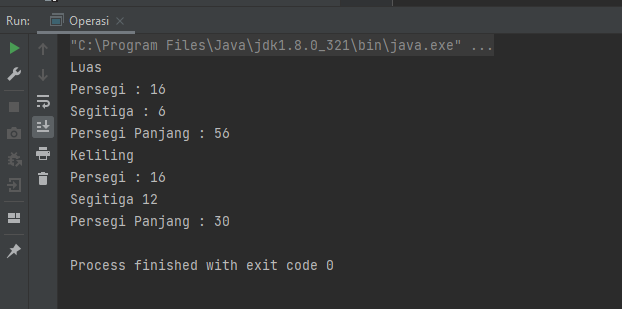
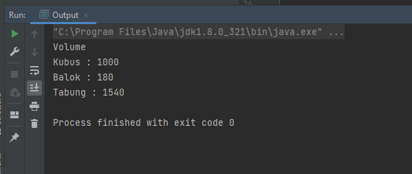
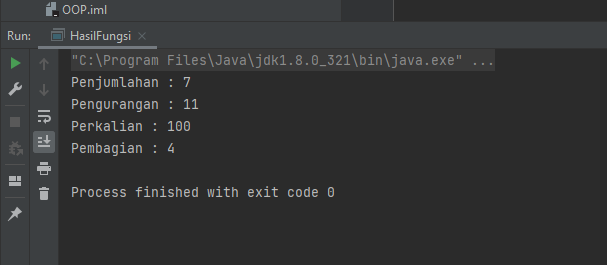
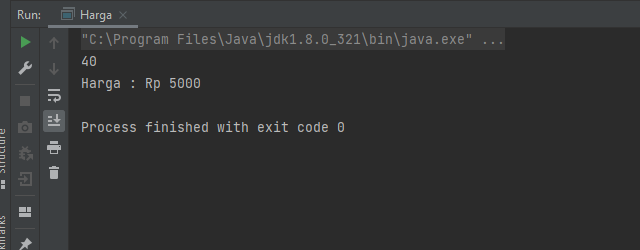

# 11 Object Oriented Programing

## Kompenen Object oriented programing

1) class : berfungsi untuk mengumpulkan fungsi atau variabel dalam satu temapat,class 
           merupakan blueprint dari objek.untuk penamaan class diawali dengan huruf 
           kapital dan tidak perlu menggunakan spasai apabila nama class terdiri dari
           2 kata.

2) method : berperan untuk menjelaskan aksi dari attribute.

   - variabel
   - access modifier

3) attribute : bagian dari sebuah class,bisa disebut properties dari sebuah class.

4) inheritance : hubungan anatara dua objek atau lebih,terdapat suatu objek utama 
                 yang mewariskan attribut atau method ke class lain.

5) object : 

   - declaration
   - instantiation
   - initialization
   
   contoh : Motor objectMotor = new Motor ();

            - motor merupakan inisialisai nama objek
            - objectMotor merupakan deklarasi nama motor
            - new Motor merupakan instantiation objek

## Access Modifier

public : dapat digunakan pada beda class

         - class
         - package
         - subclass
         - global

private : tidak dapat digunakan pada class lain

          - class

protected : dapat digunakan pada beda class dengan syarat dalam modul yang sama

            - class
            - package
            - subclass

# TASK 11

berikut merupakan tugas praktikum yang telah saya kerjakan :

[praktikum](./Praktikum/)

berikut merupakan hasil output dari program yang telah saya buat :

- luas dan keliling

- volume

- kalkulator

- Ongkos Kirim

