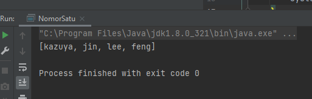
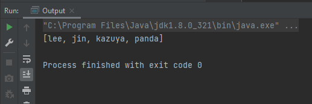

# 12 Iterable Data structure

## Iterable

   merupakan sekumpulan data atau struktur data yang dapat dilakukan itersi atau pengulangan
   kepadanya.

## Iterator 

   merupakan class yang memangae interasi dar isebuah iterable,itertor akan mengelola data yang
   ada pada iterable dan mengetahui data yang akan di ambil berikutnya serta cara mengambilnya.

## Colection

   merupakan kumpulan dari objek atau data yang ditempatkan dalam satu tempat yang sama.

## List

   merupakan sebuah interface yang menyediakan cara untu menyimpan data secara linear,list merupakan 
   turunan dari interface colection.kemudian list juga dapat menerima nilai yang sama,urutan data pada
   list bergantung pada data yang lebih awal dimasukan.
   
   implementation : 

- abstract list
                   
- array list                   
  -> menyediakan penyempinan data yang dinamis,artinya tidak terikat dengan kapasitas 
    data.
                    
- linkedlist
  -> merupakan struktur data yang menyimpan setiap elemenya dan terhubung satu sama lain.
               
- Immutable list
  -> merupakan bagian dari list tetapi datanya tidak dapat di ubah.

- stack
  -> menyimpan data secara linear,namun dalam pemngambilan data,data yang dimasukan pertama
     maka data tersebut yang akan keluar terlebih dahulu.

## Set

   sebuah struktur data yang menyimpada data secara linear,namun tidak dapat menyimpan data secara duplicate.pada set ini data diurutkan bukan secara data yang dimasukan duluan,namun berurutan.
   
   implementaation :

 - EnumSet
 - HashSet
 - TreeSet
 - Linked HashSet

## Queue

   mengimplementasikan first in first our list,jadi data yang diinputkan terlebih dahulu maka data itu yang lebih dulu diambil,sama halnya dengan mekanisme dalam antrian.
   
## Deque

   merupakan sebuah queue namun memiliki dua ujung,artinya kita dapat mengelola data dari depan dan belakang.

# TASK 12

berikut hasil praktikum yang telah saya buat

[praktikum](./praktikum/satu/)

untuk screenshots dari output

- nomor 1

