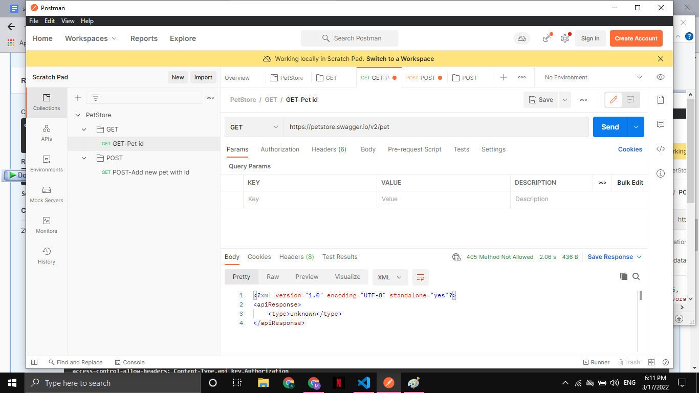
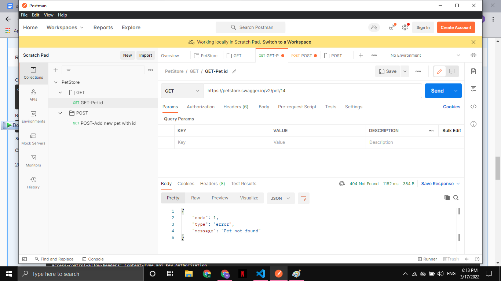
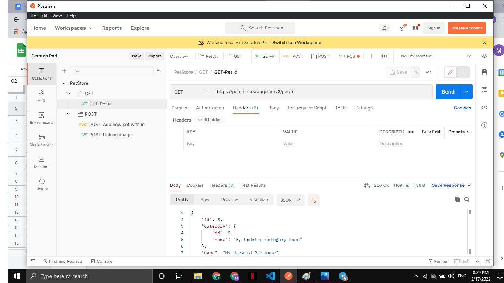
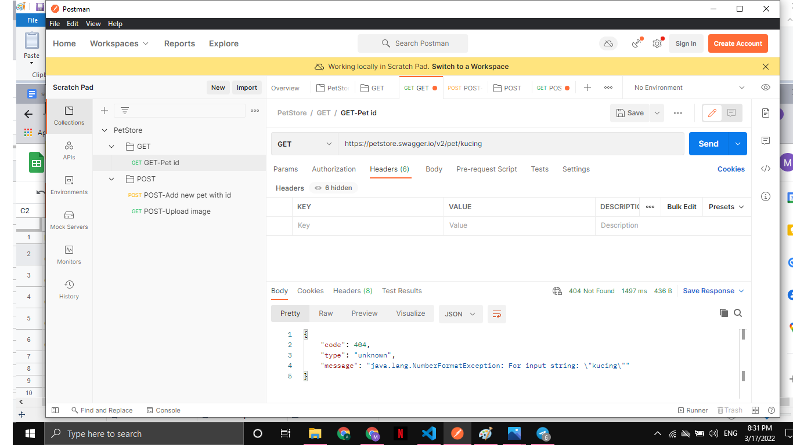
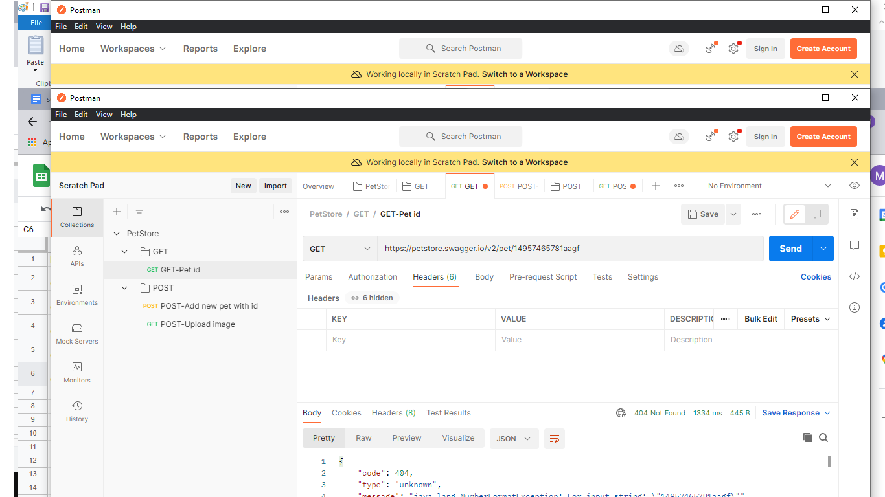
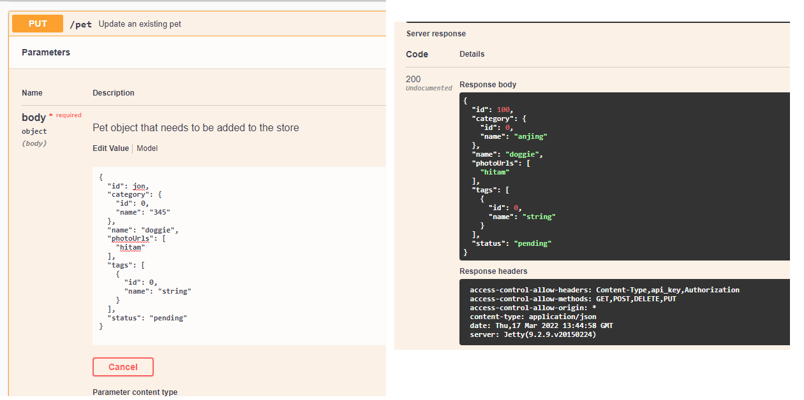
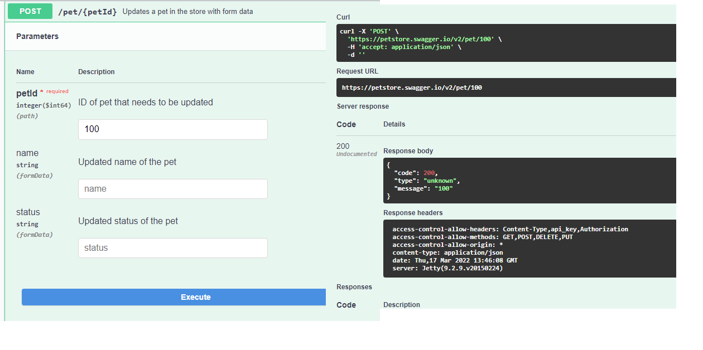
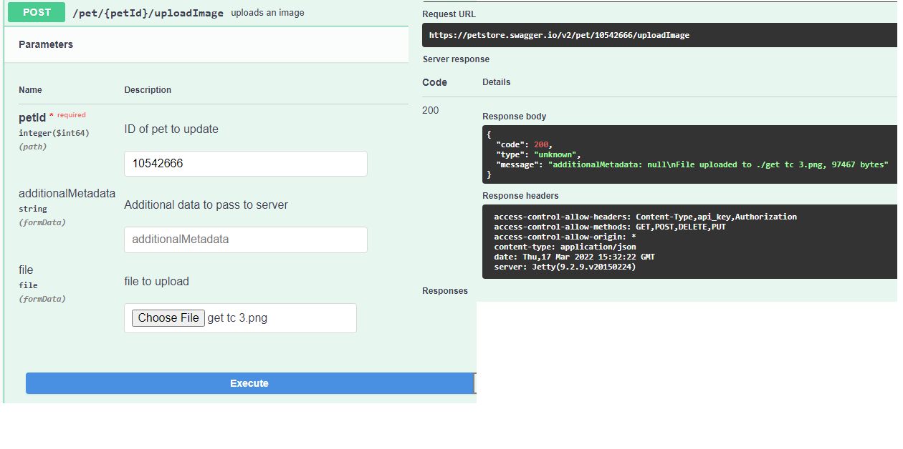
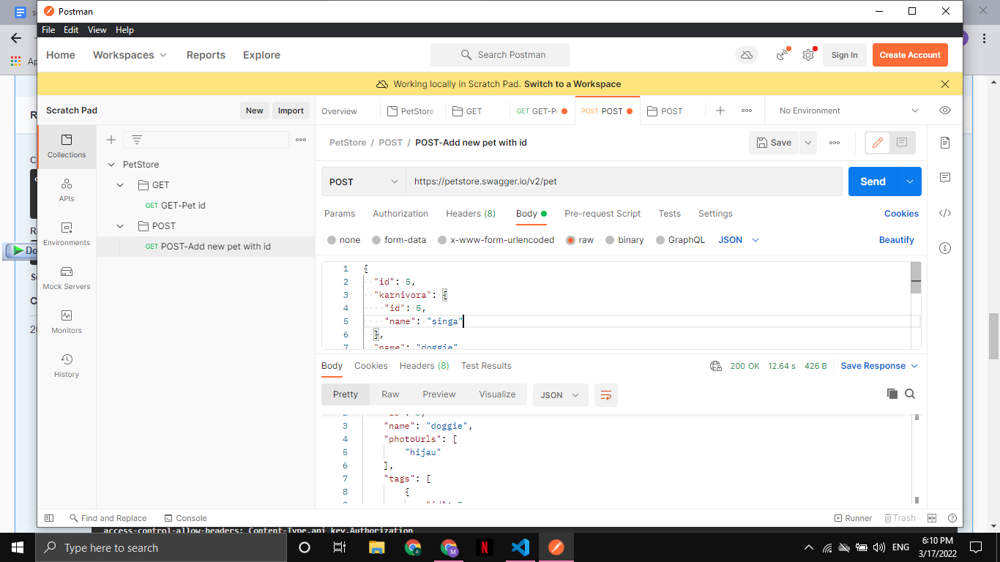
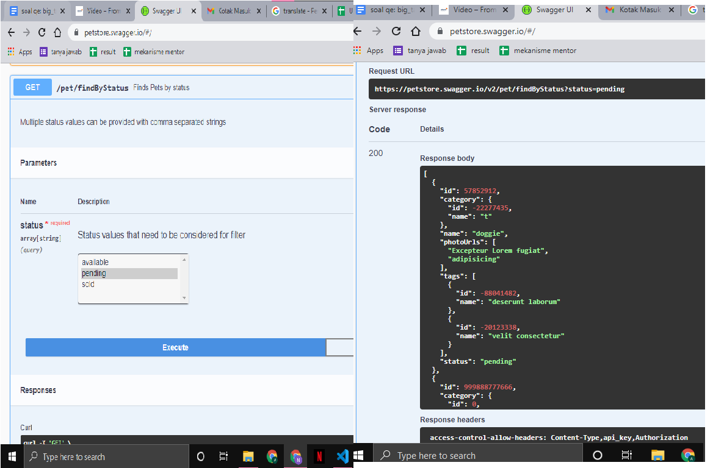

# TASK SECTION 15

Pada task ini melakukan API testing pada link yang ada pada materi,berikut ini merupakan test case yang telah saya buat.

https://docs.google.com/spreadsheets/d/1sAPWUd6bFK1Op474H_6_C6pKiR8bAGLExdrMt7gRcOo/edit?usp=sharing

## Screenshots dari Test API

1) GET pet find by id

2) PUT update an existing pet

3) POST updates pet in the store with form data

4) POST upload image

5) POST add a new pet 

6) GET finds pet with status

