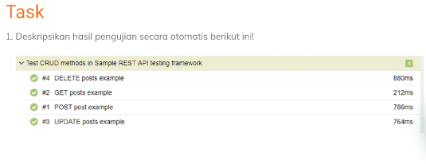
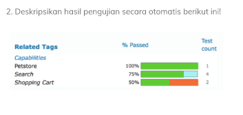

# TASK SECTION 16

Soal nomor 1

jawab :

dari beberapa data diatas dapat dilihat waktu dalam melakukan automation testing terhadap REST API,
dalam melakukan automation test terhadap method DELETE,POST dan UPDATE itu lebih 
membuthkan waktu yang lama dibandingkan dengan method GET.hal itu karena pada method GET hanya
menampilkan data saja kita tidak melakukan apapun terhadap data yang muncul sehingga
lebih memerlukan waktu yang singkat.sedangkan untuk yang lainya kita akan melakukan
beberapa perubahan input data yang berulang  sehingga jelas membutuhkan waktu yang
sedikit lama.

Soal nomor 2

jawab :

pada soal diatas ada beberapa hasil dari automation test yaitu :
- petstore dengan satu test case yang passed
- search dengan empat test case yang mana tiga diantaranya passed dan ssatu test case tidak dilakukan
- shopping chart dengan dua test case yang mana satu passed dan satu lagi fail

