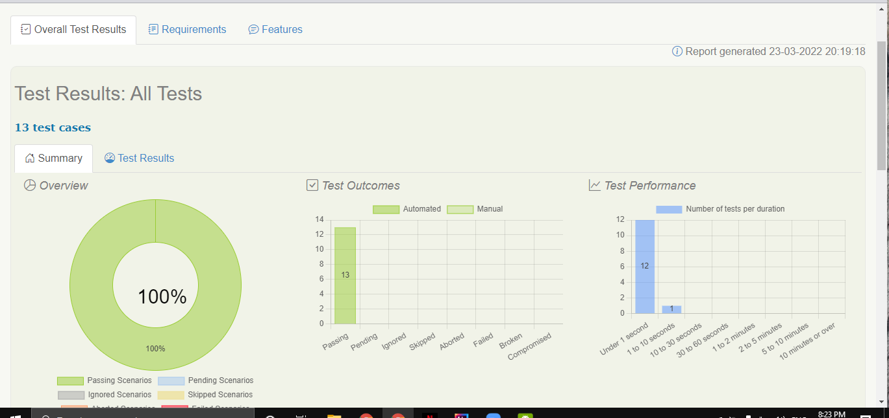

# BDD (Behavior Driven Development)

TDD merupakan proses software development yang menerupakan penulisan
test cases sebelum developer menuliskan code.proses TDD sendri berfokus 
pada kompenen dalam sistem,dan test cases ditulis dalam bahasa pemrograman.

serupa dengan TDD,BDD jyga menerpakan konsep test-first,namun dengan 
fokus yang beberda.dalam BDD test tim developer akan menuliskan berbagai
skenario yang menjelaskan behavior sistem perspektif pengguna.skenario
dituliskan menggunakan format bahasa yang mudah dipahami oleh selruh 
stakholder dalam pengembangan sistem.

BDD memiliki tujuan utama untuk meningkatkan komunikasi dan kolaborasi
antara seluruh stakholders,tim bisni maupun teknikal yang terlibat dalam
pengembengan sistem.hal ini dapat membantu memastikan bahwa :

- fitur dalam sistem dapat dipahami dengan baik oleh seluruh anggota tim.
  komunikasi yanng baik akan membantu dalam menyatukan persepsi stakholders
  yang berbeda.

- fitur dalam sistem dapat memenuhui kebutuhan pengguna dan menghasilkan 
  business value.

## BDD format
1) user story 

2) - as a[X]
   - i want[Y]
   - so that[Z]

3) scenario

4) - given
   - when 
   - then

## Cucumber
untuk melakukan BDD diperlukan tools seperti cucumber,cucumber membaca
semacam ketentuan yang dapat di eksekusi.ketentuan ini nantinya akan 
terdiri dari beberapa scenario.

# TASK SECTION 17

Berikut ini adalah link report 

file:///D:/BDD/target/site/serenity/index.html

preview dari report : 

