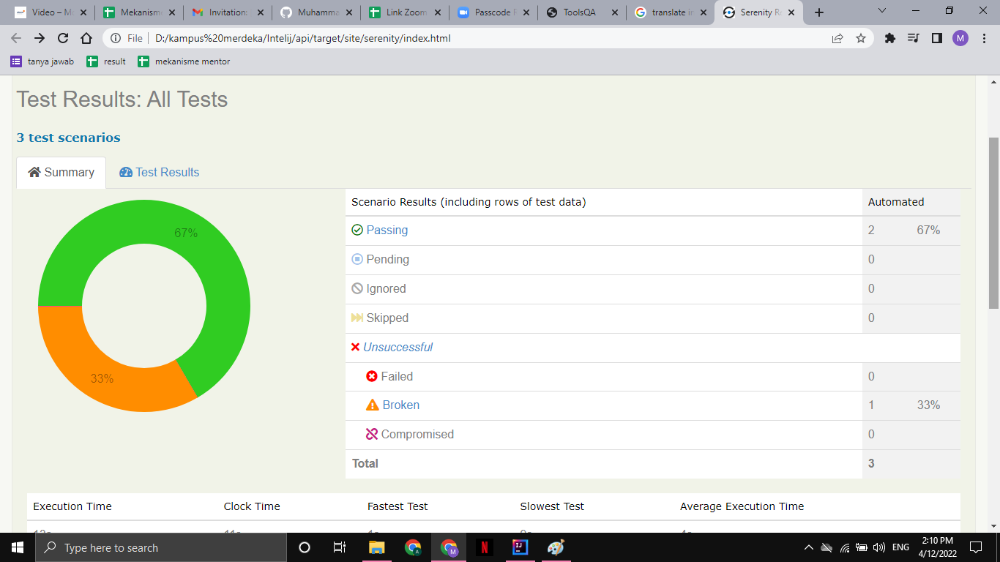

# RESTful API Testing With Rest Assured

## Rest API
Rest merupakan standar arsitektur komunikasi berbasis web yang sering diterapkan dalam pengembangan layanan
berbasis web,umumnya menggunakan HTTP sebagai protokol untuk komunikasi data.Rest juga merupakan salah satu
implementasi dari webservice sebagai standar untuk melakukan pertukaran data.
Rest API berisi aturan atau batasan yang dapat membatasi programer untuk mengakses atau melakukan tindakan
tertentu pada sebuah data base.data yang digunakan dalam Rest API umumnya berupa JSON.

## API Concept

Mobile App (request) -> API (request) -> Application (response) -> API (response) -> mobile app

## Fundamental API
- mobile app
- API server
- Ext process
- API testing

test process :
  - defenisikan API yang akan dites 
  - inputkan data yang dibutuhkan
  - sent request ke server 
  - lakukan validasi terhadap respon

## Test Pyramid

test pyramid dimulai dengan unit dan diakhiri dengan UI,jadi Unit berada pada dasar piramid. 
- UNIT
- Component
- Integration
- UI

## BDD with Cucumber
1) Write Story
2) Map Steps to java
3) Configure Stories
4) Run Stories
5) View Reports

## Rest Assured
- Support fot HTTP methods
- Support for BDD/Gherkin 
- Use of hamcrest mathces for cheks
- use of gpath for selecting element from JSON response

# TASK

report : 

