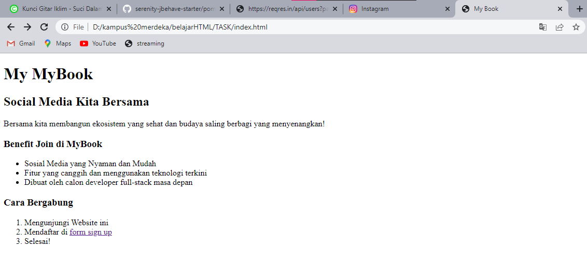
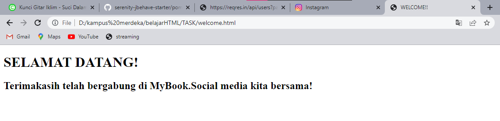

# Web Programing

## FrontEnd
merupakan sebuah bagian dari website yang membuat tampilan yang menarik kepada user.

### HTML
HTML (hypertext markup language) adalah sebuah standar yang digunakan secara luas untuk menampilkan halaman
web.

#### Kegunaan HTML 
- membuat struktur dari halaman website
- mengatur tampilan dan isi dari halaman web
- membuat tabel dengan tag HTML table
- membuat form HTML 
- membuat gambar dengan canvas
- mempublikasikan halaman website secara online

#### Dokumentasi HTML
1) <! DOCTYPE html> : mendefenisikan dokumen ini sebagai HTML5
2) html : elemen root dari halaman HTML
3) head : berisi informasi meta tentang dokumen
4) title : menentukan judul untuk dokumen
5) body : berisi konten halaman yang terlihat

# TASK SECTION 19

Berikut ini task mengenai web sederhana yang telah saya buat

[index](./praktikum/index.html)

[form](./praktikum/form.html)

[welcome](./praktikum/welcome.html)

selanjtunya untuk hasil yang saya dapatkan dari web sederhana ini dapat dilihat pada screenshots dibawah ini :

gambar diatas merupakan tampilan awal dari web yang dibuat dimana terdapat link untuk melakukan sign up

selanjutnya gambar diatas adalah form sign up yang dapat diisi kemudian setelah semua terisi kita dapat click button sign up yang nantinya akan dikirimkan pada web welcome.

