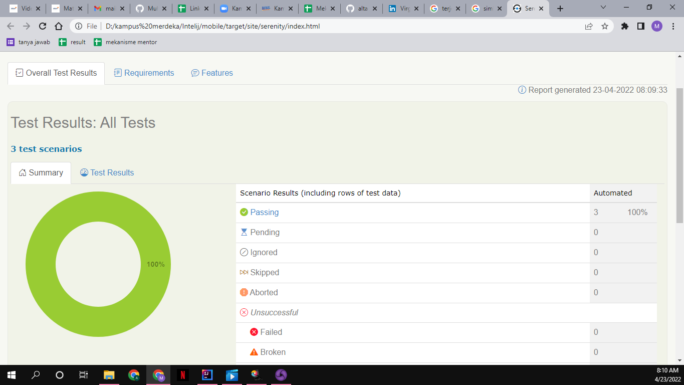

# Mobile Testing

## Appium 

- appium merupakan frameworks mobile automation yang berguna untuk menjalankan automation test
- appium support tehadap beberapa bahasa separti java,python dll
- appium library is created in top selenium library
- appium support unutk android,iOS dan windows

### Appium high level architecture

- client -> appium server -> XCUITest(iOS)
- client -> appium server -> UiAutomator/espresso(Android)
- client -> appium server -> WinAppDriver(windows)

Appium kompenen :

- appium server
- appium client

## langkah-langkah yang perlu diperhatikan dalam melakukan mobile testing

1)install android studio dan download semua sdk yang diperlukan serta buatlah emulator

2)jika tidak memungkinkan untuk menggunakan emulator gunakan real device,atur beberap
 opsi di device didalam developer option

3)install appium server dan appium inspector

4)setelah semua tools di atur selanjutnya buka appium server dan mulai server

5)kemudian pada appium inspector sebelum memulai session pastikan semua capabilities 
  yang diperlukan telah diset.

6)selanjutnya mulai session pada appium inspector setelah itu akan muncul otomatis
  aplikasi yang akan di uji di emulator maupun di device

7)pada appium inspector kita dapat memilih beberapa element locator yang diperlukan
  dalam membuat automation pada intelij
  
8)setelah automation diselesaikan saat akan mencboa melakukan tes pastikan appium
  server terhubung dan automation tes akan berjalan.

# TASK

praktikum

[mobile](./praktikum/mobile/)

hasil :

