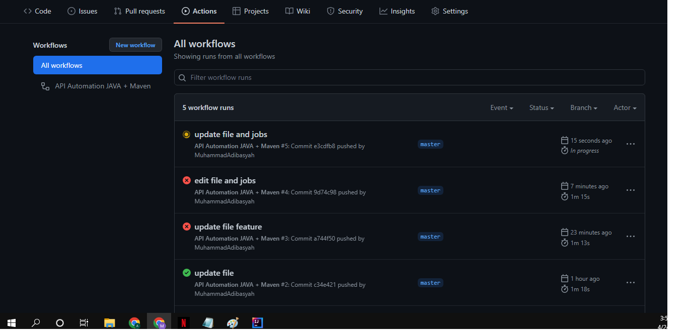
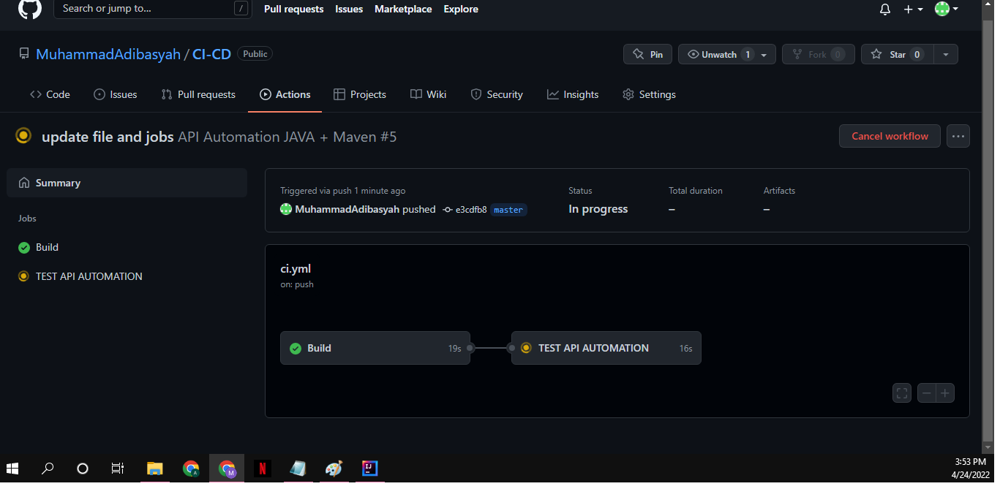

# Testing in CI/CD Pipeline

## Continuous integration
CI is the practice of integrating code into a shared repository and building/testing each change automatically,
as early as possibe-usually several times a day.best achived through integration with version control.
CI Pipeline : build -> unit test -> integration test

### what makes for good CI

- decoupled stages
- repeatbale
- fail fast

### benefits of implementing CI

- detecting bug in early stage
- reduces bug count
- development process more transparent
- efficient

### cost CI

- write automated test
- server for automated test
- merge the code as often as possible

## Continuous Delivery/Deployment
CD adds that software can be released to production at any time,often by automatically pushing changes to a
staging system.
Continuous deployment goes futher and pushes changes to production automatically
CD Pipeline : review -> staging -> production

### what makes for good CD

- design with system in mind
- pipelines
- globaly unique versions

### benefits of implementing CD

- reduce the risk
- painless deployment
- reduce costs
- automated and transparent process
- release more frequently

### cost CD

- strong foundation
- need highest quality test
- documentation needs to be updated frequntly

## CI/CD Process

commit ->  build -> test -> deploy

## CI/CD Tools

1) jenkins 

jenkins is an open-source automation tool written in java with plugins built for continuous integration.

- open source tool
- easy to install
- over 1000++ plugins 
- built with java
- free of cost
- automatically monitor code quality and metrics

2) gitlab CI

gitlab CI service is a part of gitlab which manages the project and user interface and allows unit tests on
every commit and indicates with warning message when there is unsuccessful of build.

- integrated in gitlab interface
- simple usage
- integrate with other tools
- executed on multiple platforms
- open source

3) github actions

github actions is a continuous integration and continuous delivery (CI/CD)platform that allows you automate
your build,test,and deployment.

- hosted vm with multiple os
- CI templates 
- simple container and os testing
- free

Component github actions :

- workflows
- jobs
- actions
- events
- runners

# TASK 

praktikum :

https://github.com/MuhammadAdibasyah/CI-CD.git

berikut adalah hasilnya :

