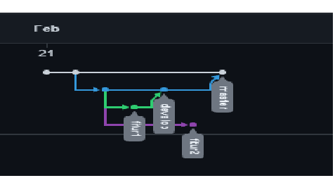

# 2 Versioning Control With Git

## Versioning Control
    Versioning control merupakan sebuah sistem yang dapat mencatat perubahan terhadap suatu folder atau file.
    Dalam hal ini berbagai catatan seperti waktu,user dan lain lain akan di tuliskan.
    sehingga hal ini dapat memudahkan kita dalam melakukan revisi terhadap suatu folder ataupun file.
    pada sectio 2 ini salah satu versioning control yang digunkan adalah git.

## GIT dan Github
    untuk selanjutnya adalah git dan github,2 hal diatas sangat membantu kita dalam menyelesaikan suatu project yang dapat dikerjakan bersama-sama,
    github ini dapat berfungsi untuk meletakan file secara onlie
    yang nantinya dapat di akses secara bersama-sama.
    tempat meletakan file itiu disebut juga dengan repository nantinya akan dihubungkan 
    master dari file atau folder di pc kita ke repository ini
    sehingga nantinya apabila ada perubahan dari teman kerja dapat langsung di akses di repositroy

## Perintah pada Git
    1. git add : berfungsi untuk menambahkan file atau folder
                 dalam menambahkan folder dapat dilakukan dengan langsung banyak folder
                 dengan perintah "git add ."
    
    2. git commit : sebelum melakukan push ke repository harus terlebih dahulu melakukan commit
                    agar nantinya perubahan terbaru dapat terupdate di repository

    3. git push : untuk memasukan file ke repository yang ada pada github

    4. git branch : fungsi ini bertujuan untuk menambahkan branch baru.
                    apa itu branch baru? branch baru ini secara simpel bertujuan
                    untuk melakukan perubahan terhadap sebuah file namun 
                    file master atau file aslinya tidak di rubah atau di otak atik,
                    sehingga akan memudahkan saat membuat perubahan terhadap project 
                    serta mengatasi bentrok saat menyeleasaikan project secara bersama.

    5. git checkkout : perintah ini untuk berpindah dari branch satu ke branch lainya.

    sebenarnya masih banyak perintah yang ada pada git namun untuk yang saya sebutkan diatas
    merupakan beberapa perintah yang sering digunakan.
    selanjutnya cara menghubungkan ke repository dapat dilihat saat membuat akun dan membuat repository baru.

### Task Versioning Contorl With Git
 