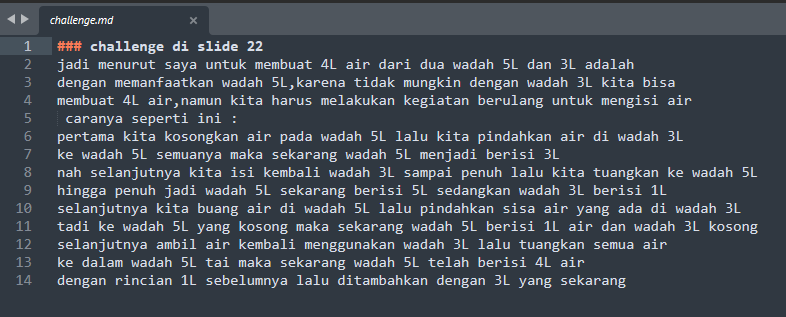

# 3 Software Testing as a Career Path

## Sofware Testing
merupakan proses verifikasi sistem/program/ komputer untuk
menentukan apakah suatu project/program/sistem memenuhi persyaratan
sebagai hasilnya dapat mengidentifikasi bug dalam suatu project 

## Beberap hal yang harus dilakukan oleh software tester
    1.memahami persyaratan dokumnen
    2.membuat tes kasus
    3.melakukan tes terhadap kasus
    4.melaporakan bug dan menguj kembali
    5.hadir pada review meeting terkait project

## Skil yang harus dimiliki sofware tester
    a) Non-technical skills               
        1.analytical skill 
        2.communication skill 
        3.time management 
        4.great atitude 
        5.passion

    b) technical skills
        1.basic knowladge 
        2.test management tool
        3.tracking management
        4.automation testing tool

## Pengelompokan untuk karir software tester
    1.junior Quality Engineer (fresher)
    2.Quality Engineer        (1-2 tahun pengalaman)
    3.senior Quality Engineer (lebih 3 tahun pengalaman)
    4.Quality Engineer lead   (5-6 tahun pengalaman)
    5.Quality Engineer manager(8-11 tahun pengalaman)

## how to become software tester ?
menguasai sofware testing,test case managemnet tools,automation testing,
kemudian aplikasikan pada saat masuk dunia kerja 

### challenge di slide 22
    problem :
    
    penyelesaian :
 jadi menurut saya untuk membuat 4L air dari dua wadah 5L dan 3L adalah
 membuat 4L air,namun kita harus melakukan kegiatan berulang untuk mengisi air
 caranya seperti ini :
 pertama kita kosongkan air pada wadah 5L lalu kita pindahkan air di wadah 3L
 ke wadah 5L semuanya maka sekarang wadah 5L menjadi berisi 3L
 nah selanjutnya kita isi kembali wadah 3L sampai penuh lalu kita tuangkan ke wadah 5L 
 hingga penuh jadi wadah 5L sekarang berisi 5L sedangkan wadah 3L berisi 1L
 selanjutnya kita buang air di wadah 5L lalu pindahkan sisa air yang ada di wadah 3L
 tadi ke wadah 5L yang kosong maka sekarang wadah 5L berisi 1L air dan wadah 3L kosong
 selanjutnya ambil air kembali menggunakan wadah 3L lalu tuangkan semua air
 ke dalam wadah 5L tai maka sekarang wadah 5L telah berisi 4L air
 dengan rincian 1L sebelumnya lalu ditambahkan dengan 3L yang sekarang