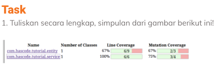
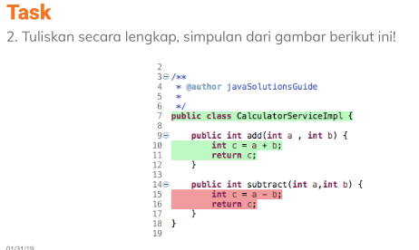

# 4 Software Testing Fundamnental 

## Pengertian Sofware Testing
sebuah proses menganalisis suatu item perangkat lunak untuk mendeteksi  
 keadaan perangkat lunak yang sudah dan yang akan diperlukan,serta utnuk mnegevaluasi fitur dari 
 item perangkat lunak tersebut.

## Kenapa penting software testing ?
karena dengan adanya software testing kita dapat melakukan bebrapa hal diantaranya :

	 1.kita dapat menghemat uang 
	 2.Mendapatkan qualitas produk yang baik
	 3.Menjaga keamaanan 
	 4.Menyenangkan hati pelanggan 

dari cerita yang ada pada slide sangat terlihat jelas bagaimana dampak dari adanya bug,
dari cerita pertama mengakibatkan orang kehilangan uang sedangkan pada cerita kedua
menyebabkan nyawa orang melayang,oleh karena itu software teting di perlukan agar
dapat menyempurnakan suatu sistem yang dibuat dan menghindarkan resiko yang fatal.
 
##  Testing Plaatform
Dibedakan menjadi 4 yaitu 

	a)API
	b)Web
	c)Mobile
	d)Desktop

## Tipe-tipe dari software testing
	a)Functional testing
	  Jenis pengujian yang mana menguji setiap funsgi apakah telah sesuai 
	  dengan syarat spesifikasi.Functional testing dapat dibedakan atas 
	  manual testing dan Automate testing

      a)Functional testing
	  Jenis pengujian yang mana menguji setiap funsgi apakah telah sesuai 
	  dengan syarat spesifikasi.Functional testing dapat dibedakan atas 
	  manual testing dan Automate testing
          
          1.Manual Testing 
            * Penguji melakukan pengujian secara manual tanpa bantuan script,
              tujuanya agar terhidar dari bug atau cacat dalam pengguanaan.
            * pada manual testing yang melakukan pengujian adalah tester.
            * Pada manual dapat diberikan tambahan fitur sesuai dengan permintaan
              sehingga untuk design UI pun lebih fleksibel

          2.Automate testing
            * pengujian software dengan menggunakan sfotwware testing,tujuanya
              untuk melihat output yang sebenarnya dan yang diprediksi.
            * pada automatae yang tester membuat script dan dijalankan dengan
              automation tools.
            * Pada automatae ini utnuk design UI sangat terbatas

    b)Non-functional testing
           pengujuan ini dilakukan setelah functional testing dilakukan yang dilihat dari 
           pengujian ini seperti salah satunya performa dari suatu software,jadi pada non
           fuctional testing ini kita dapat menilai bagimana hasil dari suatu produk yang 
           telah kita buat apakah perlu ada peningkatan performa atau sebagainya.

    c)Maintenece Testing
           Pada pengujian ini dilakukan setelah produk/software telah di gunakan oleh
           pengguna sehingga nantinya setelah digunakan oleh konsumen maka akan dilakukan
           lagi peningkatan pada software.

## Levels Of Testing
    a)Unit Testing
           yang di uji pada unit testing adalah unit-unit dari suatu perangkat lunak
           seperti function,modul,maupun objek.adapun tujuan dari unit testing ini untuk
           memvalidasi setiap unit pada kode perangkat lunak agar berjalan sesuai yang
           di harapkan.
           Bererapa automation tools : j-unit,m-unit,dll
  
     b)Integration Testing
           pengujian terhadap gabungan dari unit-unit yang ada,jadi yang di lihat disini
           kombinasi dari setiap gabungan unit tadi.adapun tujuan dari integration testing
           adalah sebagai berikut : - memriksa sebuah aplikasi agar berjalan dengan baik
                                    - memeriksa kinerja dari sebuah aplikasi dan software
                                    - mengetes atau menguji struktur program yang dirangcang
           
    c)System Testing
           merupakan pengujian atau testing yang dilakukakn terhadap keseluruhan sistem,yang 
           mana di sini diuji functional maupun non-functional dari suatu sistem agar dapat
           menegtahui kelayakanya untuk di pakai.
            
    d)Acceptance Testing
           berguna untuk menentukan apakah suatu software yang di develop telah dapat digunakan
           sesuai dengan kebutuhan,pengujian ini dilakukan terakhir setelah unit testing,integration
           testing dan system testing.

# TASK SECTION 4

        nomor 1
    Pada soal pertama menampilkan suatu data yang mana terdapat istilah line coverage
    dan mutation coverage.dari beberapa sumber yang telah saya pelajari saya dapat 
    mengambil sedikit kesimpulan,jadi data diatas itu menunjukan hasil dari mutation 
    testing.setiap perubahan pada line program disebut dengan mutan dan perubahan
    pada program itu disebut mutasi,mutasi akan dimatikan jika menyebabkan 
    kegagalan pada test case begitu juga sebaliknya
    selanjutnya apabila nilai coverage mutation 100% maka test case dianggap sudah cukup,
    namun apabila belum sampai 100% maka harus dilakukan sesuatu hal yang dapat membuat
    coverage mutation samapai 100%.
    jadi sebagai contoh untuk gambar di baris kedua itu line coverage nya 100%
    namun pada mutation coverage nya 75% (3/4) jadi masih perlu melakukan perubahan
    pada test case agar coverage mutation nya 100%

     nomor 2
    Pada soal kedua ini merupakan cara agar coverage mutation dapat mencapai 100%
    kita harus melakukan perubahan pada test case.pada gambar terlihat dilakukan
    perubahan dari program yang berwarna hijau menjadi warna merah tujuanya agar
    coverage mutation dapat maksimum sehingga dirubah test case menjadi salah
    karena apabila salah maka mutan akan mati dan nilai coverage mutation yang awalnya
    tidak mencapai 100% dapat mencapai 100%
    sama dengan soal pertama jadi berarti jika awalnya nilai coverage mutation 75%
    (3/4) maka setelah dilakukan perubahan pada test maka yang di inginkan adalah 
    coverage mutation nya menjadi 100%(4/4)

