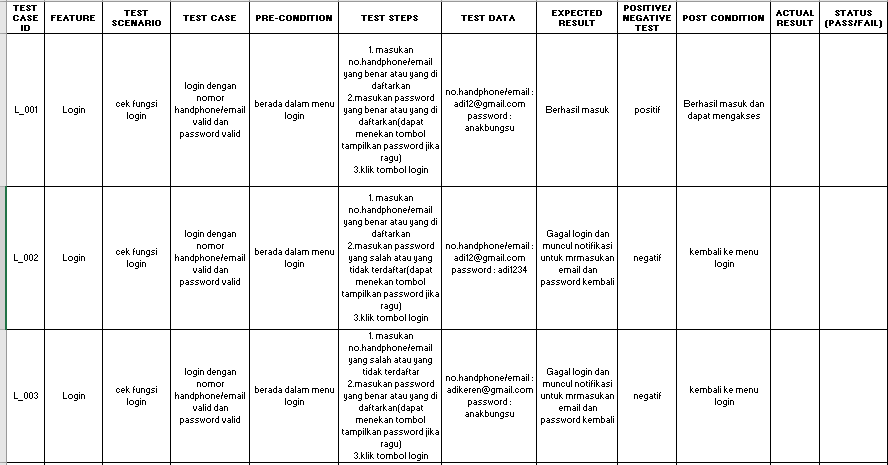

# 5 Testing Documentation (Test Scenario-Test case-dll)

## Test Scenario
       Merupakan dokumen yang berisi langkah-langkah sistematis yang disusun
       oleh software tester agar sebuah sistem dapat memenuhi standar tertentu
       dan dapat berfungsi dengan baik.
       tujuan test scenario : 

                         - memudahkan developer melakukan testing
                         - menjadi dasar pengembanagan suatu project
                         - sebagai dasar client/produk owner menyesuaikan 
                           dengan sistem requirment

## Kriteria Test Scenario 

     * menyusun scenario sesuai flo yang telah di tentukan
     * give contacs
     * give detils,memberikan rincian yang dapat dipahami oleh user
     * complete 
     * Kogheren,anatra scenario satu dan lain harus berkesinambungan
     * Prove,lengkapi dengan scenario yang telah di dapatkan 
     * Konsisten
     * end username 
     * lakukan test case yang negatif juga artinya tidak out of the box,
       pikirkan segala kemungkinan yang akan terjadi
     * update

## Test Case
     Suatu rancangan atau rangkaian menegenai tindakan yang akan dilakukan 
     oleh seorang software tester baik itu terhadap fitur,atau fungsi tertentu
     terhadap suatu perangkat lunak.
     Tujuan dari test case adalah untuk memastikan bahwa apakah perangkat lunak
     yang telah ada sesuai dengan kebutuhan awal dan berjalan dengan baik serta
     mampu memberikan respon ketika terdapat suatu masukan yang tidak valid
     Test case memiliki beberap kompenen antara lain :
         - Test case id        - test steps
         - fitur               - test data
         - status              - expected result
         - pre-condition       - actual result 

### Beberapa hal yang perlu di perhatikan dalam membuat test case

     1) Test case dibuat sederhan dan transparan
      artinya test case dibuat dengan jelas dan ringkas agar mudah di mengerti
   
     2) Test case dibuat oleh penguji dengan membuat kasus uji yang 
      mengingat prespektif dari penggguna akhir

     3) Hindari pengulangan kasus uji 
   
     4) jangan berasumsi 
   
     5) Pastikan telah memeriksa semua fitur yang ada

     6) preview 

# TASK SECTION 5

 berikut link drive dari excel saya : https://docs.google.com/spreadsheets/d/1kfYWcc8yJZeloqb3ArqyW10f3hFVTZCA/edit?usp=sharing&ouid=104547431772165651742&rtpof=true&sd=true

 preview : 

 