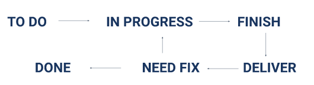

# 6 Tracking Management Tools

  Tracking management merupakan sebuah metode untuk memudahkan kita dalam
  menyelesaikan sebuah prjeoct yang mana nantinya dengan bantuan suatu software 
  seperti jira.melalui metode ini kita dapat lebih tersturuktur dalam pengerjaan
  suatu project karena dapat dilihat dengan jelas kalau project telah diselesaikan
  sampai mana dan kita juga dapat mempersiapkan segala sesuatu sebelum project
  sampai ke bagian pekerjaan kita.

## JIRA
  Jira adalah salah satu contoh dari tracking management tools,jira merupakan alat
  bantu yang bertujuan untuk pelacakan bugs,pelacakan issue dan manajemen proyek.
  Dalam sebuah project pada Jira biasanya dibuat beberapa panel untuk menyelesaiakan
  sebuah proyek diantaranya :

     1)TO DO
     panel ini berisi story yang akan dikerjakan dan sudah di prioritaskan saat planning.
     story yang ditempatkan paling atas menandakan bahwa story tersebut merupakan prioritas
     uatama.

     2)IN PROGRESS
     panel ini berisi story yang sedang dikerjakan oleh software engeineer.

     3)FINISH
     panel ini berisi story yang telah selesai dikerjakan oleh para software engineer,
     namnun belum siap untuk tahap testing
 
     4)DELIVER 
     panel ini berisi story yang siap memasuki tahap testing oleh para quality engineer.

     5)NEED FIX
     panel ini berisi proses testing yang sudah lolos kriteria oleh team development.

## Create New Issue at Jira
  Issues pada jira akan melacak masalah yang mendasari proyek ataupun bug.
  7 point for creating issue :

     1)Project 
      Project dipilih sesuai dengan issue yang akan kita buat dan di tempatkan 
      di project tersebut.

     2)Issue Type
      issue type pada jira terbagi atas 4 bagian :
        - story,jenis issue yang bisa digunakan untuk membuat fitur baru.
        - task,jenis issue yang bisa digunakan untuk melakukan perinciann 
          tugas-tugas yang akan dikerjakan.
        - bug,jenis issue yang biasa digunakan jika terjadi penemuan bug
          saat peroses testing oleh quality engineer.
        - epic,jenis issue untuk pengelompokan task.

     3)Reporter
       Tentukan reporter berdasarkan yang membuat tuags tersebut.

     4)Description
       menuliskan description dengan jelas menggunakan format yang sama dengan 
       dituliskan pada pivotal tracker.

     5)Priority
       menentukan priority berdasarkan dari tingkat kesulitan sebuah task atau 
       issue tersebut.

     6)Assignee
       menentukan assigne berdasarkan dari orang yang akan bertanggung jawab 
       mengerjakan tugas tersebut.

     7)Sprint
       menentukan sprint berdasarkan dari ruang waktu pengerjaan sebuah task 
       atau issue.(1 minggu/2 minggu)

## Fase pada Jira
   TO DO - IN PROGRESS - FINISH - DELIVER - NEED FIX - IN PROGRESS - FINISH
   -DELIVER - NEED FIX - DONE

   

### Apa yang harus diperhatikan oleh quality engineer pada Jira?
   menemukan bugs pada suatu proyek lalu melakukan beberapa hal di bawah ini :

   - membuat issue bertipe bugs ketika menemukan sesuatu yang tidak sesuai dengan
     kriteria testing.

   - memindahkan fitur yang berkaitan dengan bugs ke panel "IN PROGRESS".

## TASK section 6

dibawah ini merupakan task praktikum yang telah saya kerjakan.

[task](./praktikum/task.md)