# Command Linux

- cd : untuk pergi ke direktori yang ingin dituju

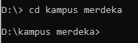

dari gambar diatas saya mencoba menuju ke folder kampus merdeka

- ls : untuk melihat isi dari suatu direktori 

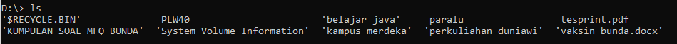

pada gambar saya melihat isi dari direktori D

- touch : salah satu fungsi touch ini untuk membuat suatu file atau folder

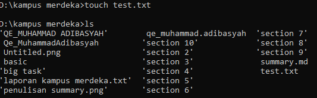

saya membuat file dengan nama test.txt

- mv : salah satu fungsi mv untuk mengubah nama sebuah file,saya mengubah nama test.txt menjadi 
       cheat.txt

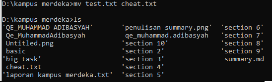

- cp : untuk menyalin suatu file,namun pada windows command cp diganti dengan command copy karena
       command pada linux tidak semuanya dapat digunakan pada windows.dari screenshot yang saya 
       buat saya menggunakan command copy terhadap file cheat.txt ke folder basic.

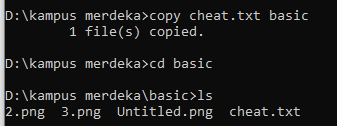

- mkdir : untuk membuat folder baru 

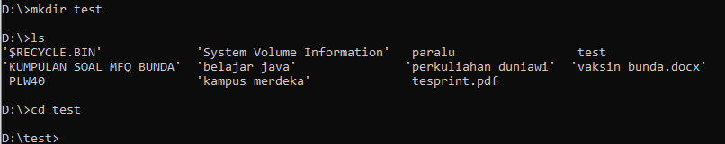

saya mencoba menambahkan folder baru dengan nama test dan kemudian saya mencoba masuk  ke folder test 

- rmdir : untuk menghapus folder

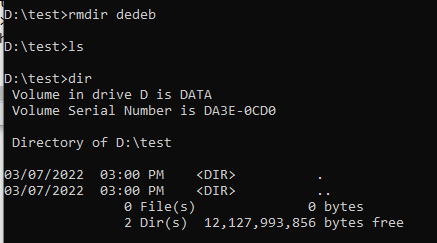

didalam folder test yang saya buat saya membuat folder dengan nama dedeb,kemudian saya menghapus folder
dedeb tersebut,dan saya masukan perintah ls untuk melihat isi dari folder test.sebelumnya terdapat folder
dengan nama dedeb kemudian setelah saya masukan perintah rmdir maka folder dedeb sekarang tidak ada lagi.

- pwd : untuk melihat direktori yang sedang aktif 

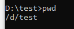

dari gambar terlihat bahwa direktori yang aktif itu test dan saya memang didalam folder itu

- clear : untuk membersihkan terminal,yang mana nantinya command yang telah ditulis sebelumnya 
          akan hilang

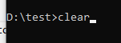

- history : untuk melihat command yang pernah kita masukan

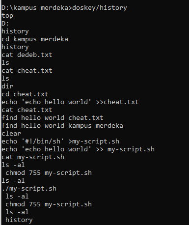

- cat : untuk melihat isi dari suatu file

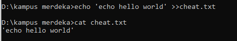

pada gambar diatas saya memasukan "echo hello world" pada file cheat.txt , kemudian saya memakai
command cat untuk melihat isi dari file cheat.txt

- find : untuk menemukan kata atau kalimat yang ingin dicari dalam sebuah file

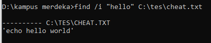

dari gambar diatas saya mencari kata "hello" di file cheat.txt yang ada pada disk C di file tes
seperti gambar diatas.