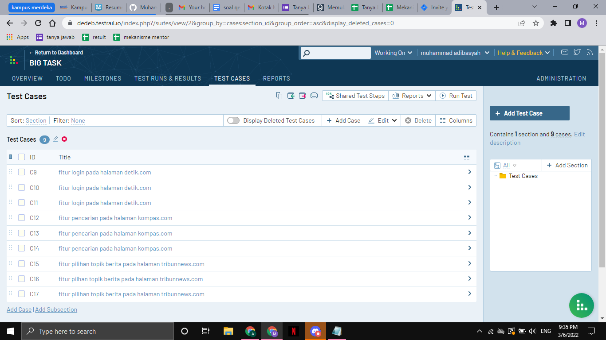
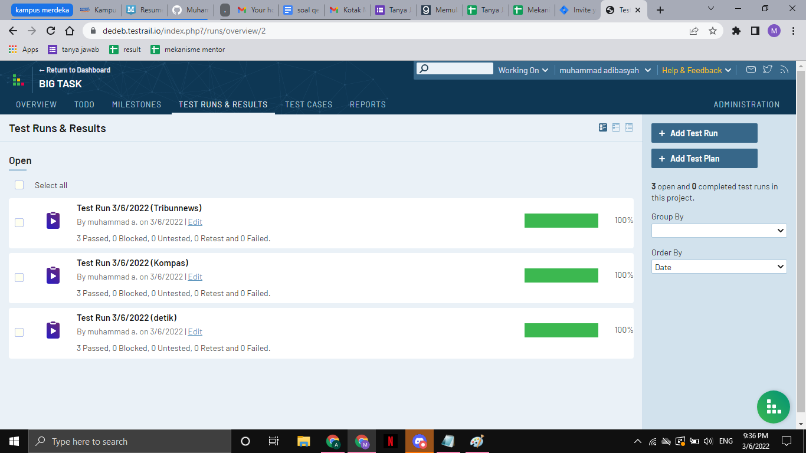
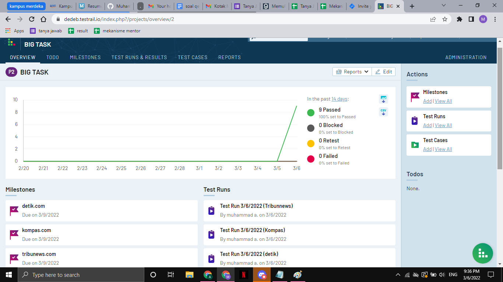
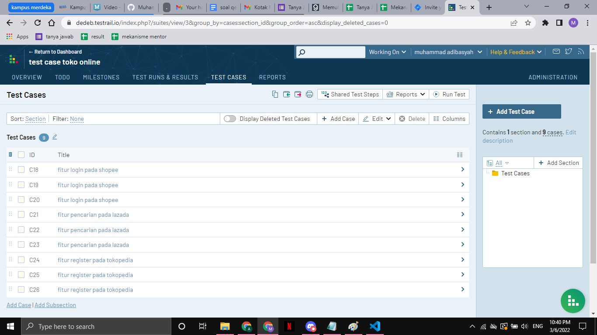
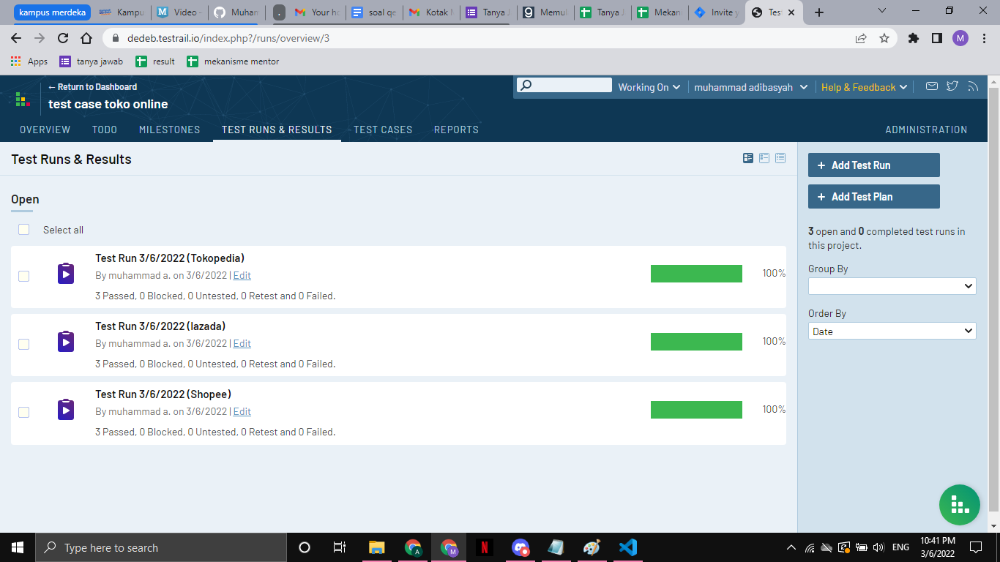
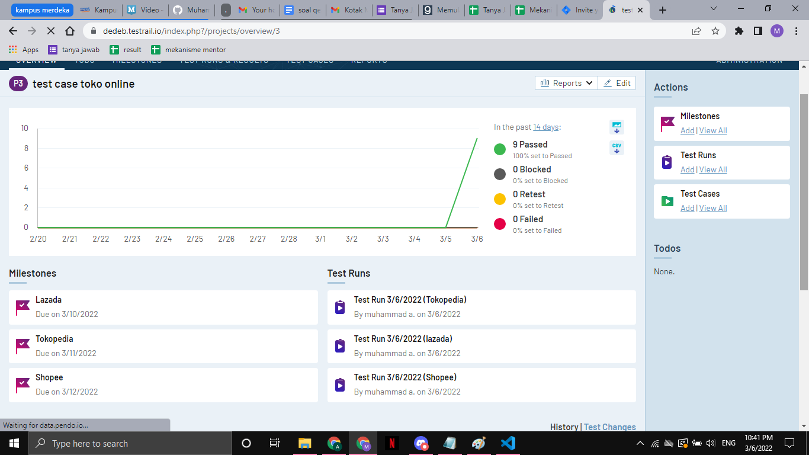
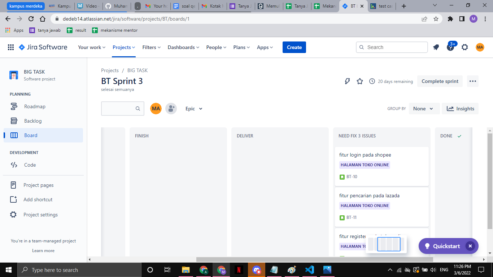
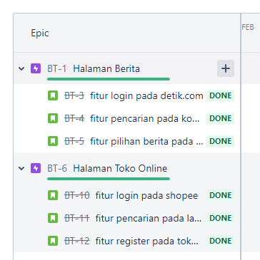

# TestRail Portal berita

Pada bagian ini saya membuat test case pada 3 halaman berita diantaranya kompas,detik dan tribunnews.
kemudian saya membuat masing-masing 3 test case untuk setiap halaman berita,dalam membuat test case
saya menggunakan tertrail.

berikut ini adalah test case yang telah saya buat :

kemudian untuk test run nya saya membagi untuk tiap halaman beritanya seperti gambar di bawah ini :

dari test run yang telah jalani semuanya berhasil dan sesuai dengan yang diharapkan,dari test case 
yang saya buat saya tidak menemukan bug pada setiap fitur yang saya uji.

selanjutnya saya mengeksekusi test case yang telah saya buat untuk tiap halaman,berikut ini adalah
overview dari testing yang telah saya jalani :

# TestRail Toko Online

saya membuat beberap testcase pada 3 halaman toko online diantaranya shopee,lazada dan tokopedia
kemudian saya melakukan hal yang sama dengan halaman berita sebelumnya.

berikut ini adalah test case yang saya buat pada testrail :

setelah saya membuat beberapa test case kemudian saya mengelompokan pada 3 test run seperti gambar
di bawah ini :

dari hasil test run yang saya lakukan semuanya sukses,dan dari test case yang saya telah dieksekusi
saya tidak menemukan bug  pada fitur yang diuji,berikut ini adalah overview dari testing yang telah
saya lakukan pada testrail terkait dengan toko online :

# JIRA

Jira membantu kita dalam memanagement pekerjaan yang dilakukan,sehingga akan jelas nantinya
pekerjaan yang sedang dilakukan telah sampai tahap mana.contohnya pada halaman toko online 
kita melakukan beberapa pengujian pada fitur-fitur yang ada,jadi pada dasarnya pada tahap 
testing ini barulah kita akan menguji test case yang telah kita buat, dalam hal membantu 
kita dalam melakukan testing maka kita dapat menggunakan testrail seperti yang telah saya 
buat sebelumnya.

berikut ini adalah tampilan dari management tools (jira)

jadi dari gambar di atas task yang dibuat telah sampai ke tahap testing,jadi untuk melakukan
pengujian makan dibantu dengan testrail.karena pada testrail yang telah saya buat saya tidak
menemukan bug maka task-task yang ada langsung menuju tahap selanjutnya yaitu done atau selesai

dari gambar di atas dapat dilihat beberapa task yang telah dibuat pada jira telah diselesaikan 
semuanya,sebenarnya pada jira ini jika kita menemukan bug pada tahap testing maka kita akan menambahakan
pada task bahwa bug telah ditemukan dan nantinya bug yang ditemukan akan dikerjakan pada tahap awal
kembali sampai nanti kembali pada tahap testing dan di uji kembali.